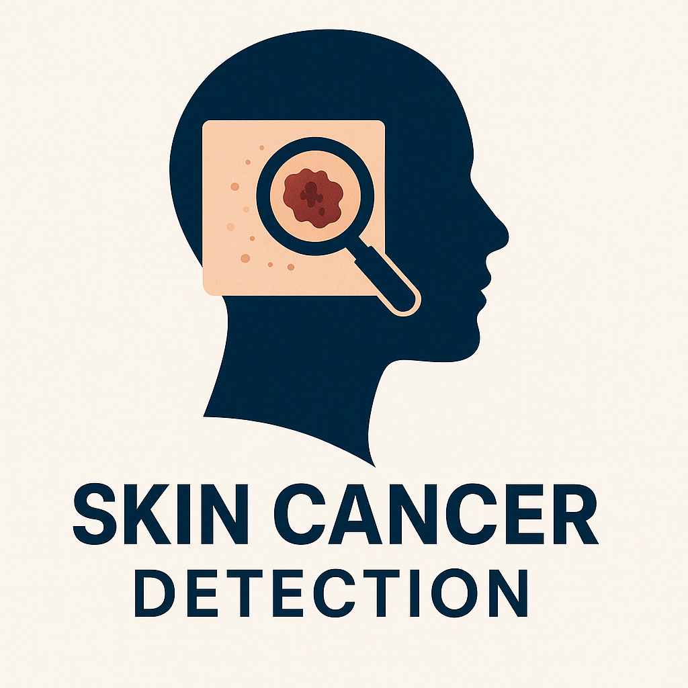
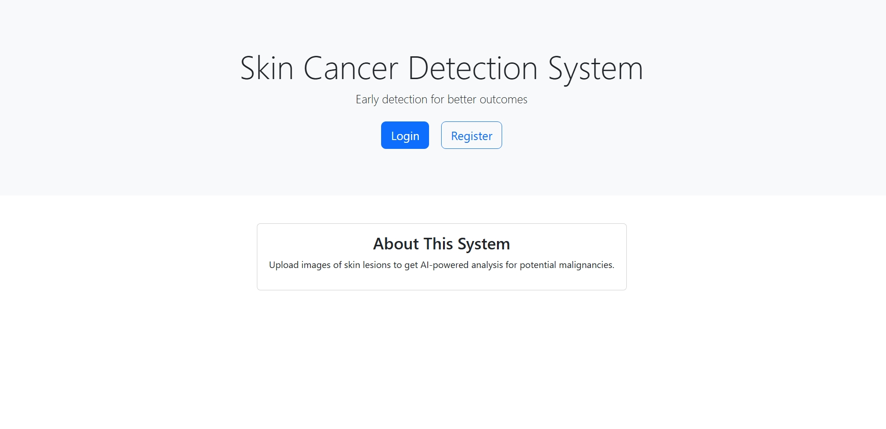
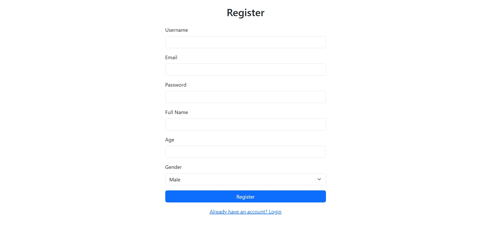
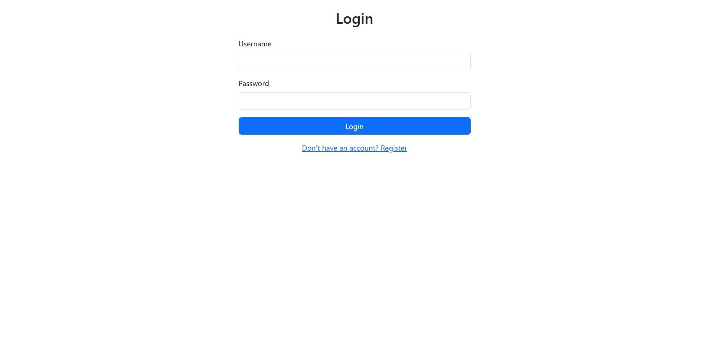
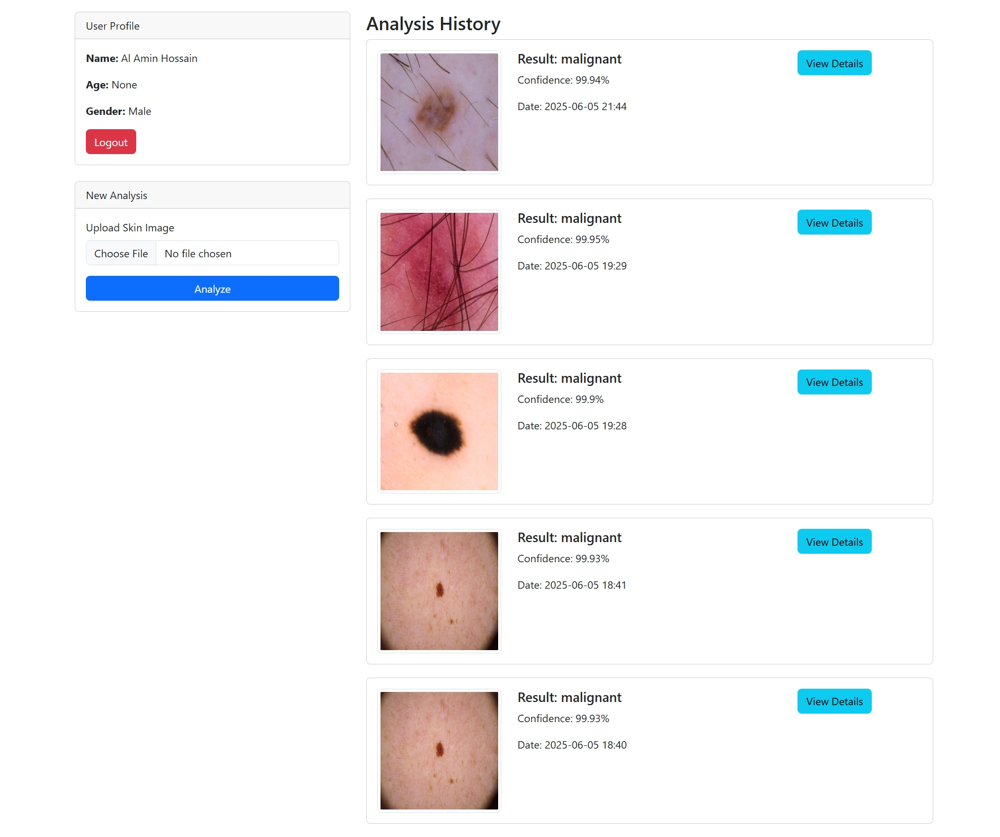
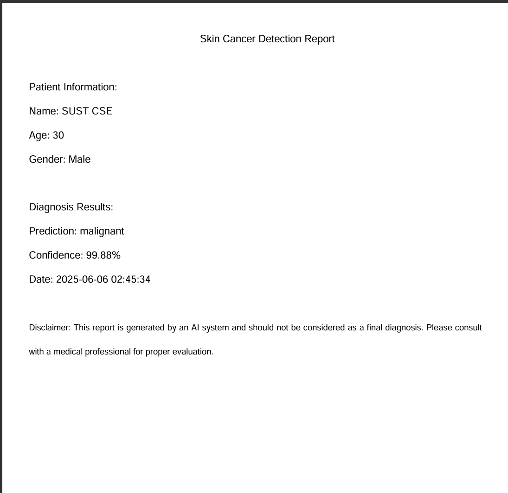

# Skin Cancer Detection System
<div align="center">
  
  <h3>Early Detection for Better Outcomes</h3>
</div>

An AI-powered web application that uses deep learning to detect skin cancer from uploaded images, with user authentication and PDF report generation.

## Features

- 🖼️ Image-based skin cancer detection (Benign/Malignant classification)
- 🔐 User authentication (Registration/Login)
- 📊 Prediction history dashboard
- 📄 PDF report generation with patient details
- 📅 Age calculation from date of birth
- 🏥 Medical notes system

## 📸 Application Interface

### 1. Home Page
  
*Landing page with login/register options*

### 2. User Registration
  
*Registration form with patient details e.g. username, email, password, name, age*

### 3. Login
  
*Login page form with username and password*

### 4. Dashboard
  
*User dashboard showing prediction history*


### 5. Prediction Results
  
*Detailed prediction results with confidence score*

### 6. PDF Report
  
*Sample generated PDF report*

## Technologies Used

### Backend
- Python 3.8+
- Flask (Web Framework)
- TensorFlow/Keras (Deep Learning)
- MySQL (Database)
- OpenCV (Image Processing)

### Frontend
- HTML5, CSS3
- Bootstrap 5
- Jinja2 Templating

### Machine Learning
- CNN Model (Custom Architecture)
- Image Augmentation
- Transfer Learning (Optional)

## Installation

### Prerequisites
- Python 3.8+
- MySQL Server
- pip package manager

### Setup Steps

1. **Clone the repository**
   ```bash
   git clone https://github.com/yourusername/skin-cancer-detection.git
   cd skin-cancer-detection
2. **Create and activate virtual environment**

    ```bash
    python -m venv venv
    source venv/bin/activate  # Linux/Mac
    venv\Scripts\activate     # Windows
3. **Install dependencies**

    ```bash
    pip install -r requirements.txt
4. **Set up MySQL Database**

    ```sql
    CREATE DATABASE skin_cancer_db;
    USE skin_cancer_db;
    
    CREATE TABLE users (
        id INT AUTO_INCREMENT PRIMARY KEY,
        username VARCHAR(50) UNIQUE NOT NULL,
        email VARCHAR(100) UNIQUE NOT NULL,
        password VARCHAR(255) NOT NULL,
        full_name VARCHAR(100),
        date_of_birth DATE,
        gender VARCHAR(10),
        created_at TIMESTAMP DEFAULT CURRENT_TIMESTAMP
    );
    
    CREATE TABLE predictions (
        id INT AUTO_INCREMENT PRIMARY KEY,
        user_id INT NOT NULL,
        image_path VARCHAR(255) NOT NULL,
        prediction_result VARCHAR(50) NOT NULL,
        confidence FLOAT NOT NULL,
        notes TEXT,
        created_at TIMESTAMP DEFAULT CURRENT_TIMESTAMP,
        FOREIGN KEY (user_id) REFERENCES users(id)
    );
5. **Configure Environment Variables**
    Create a .env file:
    
    ```env
    FLASK_APP=app.py
    FLASK_ENV=development
    DB_HOST=localhost
    DB_USER=yourusername
    DB_PASSWORD=yourpassword
    DB_NAME=skin_cancer_db
    SECRET_KEY=your-secret-key-here
6. **Run the application**

   ```bash
   flask run
### Project Structure
    
    skin-cancer-detection/
    ├── app.py                # Main application file
    ├── models/               # ML model files
    │   └── skin_cancer_model.h5
    ├── static/               # Static files
    │   ├── css/              # CSS files
    │   ├── js/               # JavaScript files
    │   ├── uploads/          # User uploaded images
    │   └── reports/          # Generated PDF reports
    ├── templates/            # HTML templates
    │   ├── base.html         # Base template
    │   ├── index.html        # Home page
    │   ├── register.html     # Registration page
    │   ├── login.html        # Login page
    │   ├── dashboard.html    # User dashboard
    │   └── result.html       # Prediction result page
    ├── requirements.txt      # Python dependencies
    └── README.md             # Project documentation

### Usage
1. Register a new account or login
2. Upload a skin lesion image from the dashboard
3. View the prediction results
4. Save medical notes if needed
5. Download PDF report of the diagnosis

### ML Model Training
To retrain the model:
1. Place training data in data/train/ with subfolders for each class
2. Run the training notebook:

    ```bash
    jupyter notebook skin_cancer_training.ipynb
### Configuration
- Edit app.py to configure:
- Database connection parameters
- File upload settings
- Model paths

### License
This project is licensed under the MIT License - see the LICENSE file for details.

### Acknowledgments
- Dataset provided by ISIC Archive
- Flask documentation
- TensorFlow/Keras documentation

## Contact

<div align="center">

### AL AMIN HOSSAIN  
🎓 **Computer Science and Engineering**  
🏛 **Shahjalal University of Science and Technology (SUST)**  

📧 **Email**: [alamin57@student.sust.edu](mailto:alamin57@student.sust.edu)  
🌐 **Portfolio**: [visible-unknown.github.io](https://visible-unknown.github.io/)  
💻 **GitHub**: [github.com/Visible-Unknown](https://github.com/Visible-Unknown)  

🔗 **Project Repository**:  
[https://github.com/Visible-Unknown/skin-cancer-detection](https://github.com/Visible-Unknown/skin-cancer-detection)
</div>

